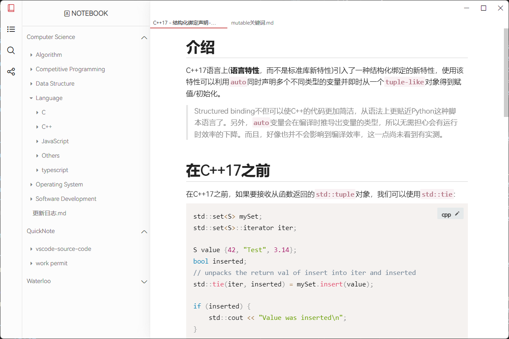

# 📕MarkdownNote (IN PROGRESS - 开发中)
An open-sourced note-taking application / markdown editor that provides WYSIWYG and noteTaking-like user experience.

基于markdown管理的笔记软件.

如果你对该项目感兴趣，非常欢迎联系我😀~ 目前开发周期还很长

## 💖features
* supports ✔WYSIWYG (rich text), ✔ tranditional split view editing
* ❌supports git extension
* ❌provides great noteTaking-like user experience

## 👁‍🗨Screen shots (2022.1.16)


## 🚪portal
- [📚wiki](https://github.com/Bistard/MarkdownNote/wiki)
- [🚕Milestone](https://github.com/Bistard/MarkdownNote/wiki/Milestone)

## 🏃 Get Started
How to run the application from the source code:
```
git clone https://github.com/Bistard/MarkdownNote.git
cd MarkdownNote
npm install
npm start
```