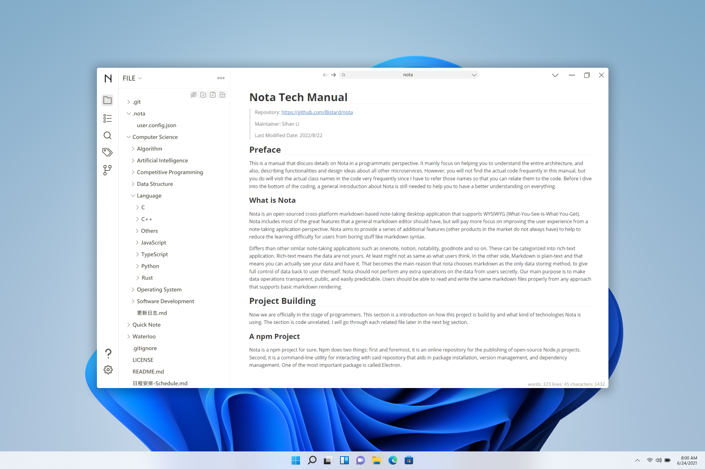

<!-- <p align="center"></p> -->
<h1 align="center">Nota (In Developing)</h1>
<!-- <div align="center">
  |
  <a href="README.md">english</a>
  |
  <a href="doc/readme/zh-cn.md">简体</a>  
  |
  <a href="doc/readme/zh-tw.md">繁体</a>
  |
</div> -->

<br>

Nota is a next-gen Markdown note-taking desktop application designed for both education and professional development. It leverages generative AI for enriched note creation, organization, and suggestions.

## 🚪Portals
- [🌎Why Us?](#🌎Why-Us?)
- [💖Features](#💖features)
- [👁‍🗨Screenshots](#👁‍🗨screenshots)
- [✅Get Started](#✅get-started)
- [💌Contributing](#💌contributing)
- [📦Architecture](#📦Architecture)

## 🌎Why Us?
> - **Open Source & Free**: *Nota* stands out as a unique note-taking solution, being both free and open-sourced. Our preference leans towards simplicity, hence our choice of Markdown (plain text) for data storage.
>
> - **AI Integration**: We are pioneering the integration of generative AI with note-taking, aiming to revolutionize the way you capture and organize information.
>
> - **Markdown - Simplified**: Unfamiliar with Markdown? No worries. *Nota* ensures that working with Markdown feels as easy and intuitive as any other format.
> 
> - **Total Data Control**: With *Nota*, your data is stored on your local disk, ensuring complete and unrestricted access at all times. Plus, even if *Nota* halts updates years from now, your Markdown notes remain accessible and editable with any markdown editor.
> 
> - **Flexibility with Cloud Storage**: With a clear distinction between *Nota* and your data, you're free to choose any cloud service for data storage, ensuring flexibility in data management.
> 
> - **Comprehensive Markdown Support**: *Nota* encapsulates the foundational aspects of Markdown writing. However, if your note-taking journey seeks advanced terrains, you might find rich-text applications more fitting.

## 💖Features

- **Core Features**: 
  - _AI-Driven Features_: Automated note categorization, organization, and summarization using generative AI and prompt engineering.
  - _Cloud Services_:  We offer cloud services for note synchronization and backup functionalities.
  
- **Accessibility**: 
  - _Markdown WYSIWYG_: we are aiming to build our own markdown WYSIWYG rendering (more performant).
  - _Effortless Organization & Search_: Smooth sorting tools and enhanced search functionalities.
  - _User-Friendly Interface_: A clean and simple UI that helps users achieve their tasks seamlessly.
  - _Easy Data Transferring_: Emphasis on transparency, with user data managed via "Markdown". Your data remains exclusively yours.

- **Extensions**:
  - _Customization_: Third-party developers can easily create and publish their extensions/plugins through our provided community.

## 👁‍🗨Screenshots
> * The current (2022.11.05) UI design is far away from GOOD.
> 
> * Since we haven't come up with a perfect UI design for *Nota*, we are still working on the foundation (backend) of the applications. That is why the screenshot has not been updated for a while.
> * If you are good at software UI design, you are welcome to contact with me!



## ✅Get Started
How to run the application from the source code:
```
git clone https://github.com/Bistard/nota.git
cd nota
npm install
npm start
```

## 💌Contributing
* 🥰Welcome to post any ideas or improvements in our github discussion section which can be found [here](https://github.com/Bistard/nota/discussions).
* 🤔Report bugs or request new features to [here](https://github.com/Bistard/nota/issues).
* 😆If you requires further discussions or wanna join us, you may [contact me in personal](https://github.com/Bistard).
* 🧐We post our monthly roadmap to the github discussion section which you may check what are we doing everyday.

## 📦Architecture
> * First of all, by reading the goodness of vscode source code, *Nota* decided not to use any existing frameworks, instead we are basically building everything from the scratch. If you read the source code of *Nota* carefully, you may find that there are some similarities compared to vscode.
> * Secondly, there are lots of functionalities that are separated into tons of microservices which are managed by our own DI system (Dependency Injection) to achieve the idea of IoC (Inversion of Control).
> * Thirdly, some places are built by the idea of MVVM (Model-View-ViewModel), one of them is how we display our tree-like structure.
> * There should be more to be disscussed, but I guess I will stop from here and do some code now.
