# 0️⃣nota设计蓝图

1. [1️⃣功能栏 - Action Bar](#1️⃣功能栏-Action-Bar)
1. [2️⃣侧边栏-Side Bar](#2️⃣侧边栏-Side-Bar)
1. [3️⃣工作区-Workspace](#3️⃣工作区-Workspace)
1. [4️⃣状态栏-Status Bar](#4️⃣状态栏-Status-Bar)
1. [5️⃣双链系统-Backlinking(暂定)](#5️⃣双链系统-Backlinking(暂定))
1. [6️⃣控制面板-Command Palette](#6️⃣控制面板-Command-Palette)
1. [7️⃣设置系统-Settings](#7️⃣设置系统-Settings)
1. [8️⃣帮助界面-Help](#8️⃣帮助界面-Help)

---

# 1️⃣功能栏-Action Bar

> 功能栏目前主要有这些按钮: `Explorer`, `Outline`, `Search`, `Version Control`，`Help`和`Settings`. 除了`Help`，`Setting`，其他的按钮主要功能是切换[2️⃣侧边栏-Side Bar](#2️⃣侧边栏-Side-Bar)所展示的区域。

## 案例展示

从左往右分别是`Visual Studio Code（之后缩写为vscode）`，`marktext`，`onenote for Windows 10`，`Obsidian`。前三个软件的`Action Bar`全部放在软件的最左侧，并且每个按钮会控制着紧贴着的侧边栏所展示的内容。需要注意的是，`Obsidian`的`Action Bar`比较特别，左侧的四个按钮和`Side Bar`是解绑的。只有靠上面的两个按钮绑定着`Side Bar`的显示内容。

|  |  |  |  |
| ---------------------------------- | ------------------------------------ | ------------------------------------- | ------------------------------------ |

## 功能

1. 除了支持上面常见的'切换'功能，还有一个功能点在前三个软件里都有实现（截gif的时候忘记测试了），就是当你再一次点击已经选择的Action Button的时候，会把`Side Bar`进行收缩，如下：

    

---

# 2️⃣侧边栏-Side Bar

> 侧边栏是和[1️⃣功能栏-Action Bar](#1️⃣功能栏-Action-Bar)所一一对应的显示区域，每一个功能按钮可以切换至不同的侧边栏显示内容。

## `Explorer`- 文件树 / 笔记树

> 在这个区域中，会出现两种渲染模式，举个例子比如通过一个按钮来切换模式。第一种是经典的[文件树浏览](#文件树浏览)，第二种是[笔记树浏览](笔记树浏览)。

### 文件树浏览

#### 案例展示

最常见的编辑器（Editor）中所会出现的一种模式，从左往右分别是`vscode`, `Typora`，`Obsidian`, `Marktext`四款软件的文件树浏览操作展示：

|  |  |  |  |
| ------------------------------------ | ------------------------------------ | -------------------------------------- | -------------------------------------- |

除了`vscode`是一款代码编辑器，剩下的三款软件的产品定位都是Markdown编辑器（不过`obsidian`更复杂一点，它的定位和`nota`一样，都是基于markdown的笔记软件而非编辑器。它支持笔记双链（`backlinking`），知识图库分析等等）。

#### 功能

这种文件树浏览最大的特点是：

1. 在同路径（Path）下，文件夹（directory）显示顺序永远比文件（file）更靠上面。
2. 排序上，只会有常见得按Alphabet排序，创建时间排序，修改时间排序。Users不能进行自定义（custom）排序。在Drag and Drop（dnd）支持上，users进行拖拽（drag）文件时，只允许进行摆放（drops）到不同的directory下面。如果试图摆放在同目录下不同的位置上（试图进行自定义排序），并不会发生任何变化。
3. 想要实现嵌套关系（nesting），只能通过创建directory来实现。但是限于第一条，强行做嵌套关系会显得格外的蠢🥱。
4. 因为数据是用户自己的，文件树所展示的样子，就是当前电脑上操作系统（Operating System，之后简称OS）（常见的MacOS，Windows，Linux）里真正的文件树的样子，没有丝毫分差。

在`nota`的文件树浏览模式下，所呈现的效果和主要功能就如上面gif和列出来的四点一样。

### 笔记树浏览

#### 案例展示

目前市场里，我只在富文本类型的笔记软件下能见到这种文件树浏览，同时也是每一个富文本类型笔记软件的标配。从左往右分别是`notion`，`onenote 2016`, `onenote Windows 10`：

> （因为是富文本的原因，所以市场上各种软件的渲染方式、操作方式属于是百花齐放了，主要我也懒没下其他软件（逃（不过这三款应该已经足够去展示其主要特点了🙂）。

|  |  |  |
| ----------------------------------- | ---------------------------------------- | -------------------------------------- |

#### 功能

笔记树浏览和经典文件树浏览最大的区别如下：

1. 没有文件（File）和文件夹（Directory）的概念，只有类似于笔记页（Page）的概念，因此笔记页可以进行互相的嵌套（Nesting）也是理所当然的事情。
2. 通过丰富得Drag and Drop（dnd）功能，users可以通过拖拽，能够进行简单易用的排序，嵌套等操作。
3. 笔记树浏览常见于富文本型笔记软件，由于用户的数据本身是和软件自身绑定的，是用户自己看不见摸不着的。因此笔记树所展示的效果跟当前OS里的真实数据没有任何关系，缺少了一种直观性。

可能会出现的按钮：

> 这里按钮的存在属于根据风格来调整，可以添加一些常用的按钮安放在`Explorer区域`的某处，比如：
>
> 1. 比如`收缩所有-Collapse All-收缩所有的展开的文件夹`，
>
> 2. `创建/删除 File/Directory/Page（我这里叫做Page是想特指在第二种渲染模式下只有一种概念叫做Page）`。
>
> 3. `按照XXX排序`。P.S. 在onenote中有会提供一个下拉按钮，有四种选项，分别是`None`, `Alphabetical`, `Date Created`和`Date Modified`。`None`指的就是采用用户自己customized排序。
>
> 为了简洁的风格，这些按钮完全可以交给右键菜单（Context Menu）去完成。

>  P.S. 应该对于绝大部分的功能来说，所有经典文件树浏览所支持的功能，在笔记树浏览下也能支持。但是在第二种笔记树浏览下，它的右键菜单（Context Menu）的功能会出现个别只有在这个模式下才会用的功能。

`nota`想要干的事情就是将这两种渲染方式的优点结合在一起。目前我能找到的所有使用markdown为数据储存的软件，不管定位是编辑器还是笔记软件，都采用的是文件树浏览。

> **下面是相关技术细节，可以略过**
>
> 这里插一句题外话，就是关于`nota`在第二种渲染模式下，要如何既能展示user的数据在操作系统下真实结构的同时，也能实现富文本笔记软件标配的丰富的Drag and Drop Support。
>
> * 如何实现排序：对于在OS里的同directory下的files，如果users在软件里面进行了custom排序，在OS里面不会进行任何操作，`nota`只会在软件层记录排序并渲染给users看，让users以为进行了排序。之后`nota`在关闭软件之后只会将这种顺序关系储存在硬盘里，下次打开同目录的时候再次读取该类信息重新渲染出来排序过后的样子即可。
>
> * 如何实现嵌套：我个人的认知中，这个业务需求的本质，是怎么将OS里的两种概念文件（File）和文件夹（Directory）巧妙地结合在一起。我的逻辑可以分成两步骤：
>
>     1. 在扫描完OS中当前目录（path）下的所有files和directory后，但在渲染画面前，通过一个customizable的`匹配规则（见后面解释）`将同path下的file和directory在软件层面里匹配在一起。
>
>     1. 渲染画面时，只会渲染files。如果当前files有互相匹配的directory，并不会渲染directory本身，只会将directory下面的所有内容渲染成嵌套在自己所匹配的file下。之后以此类推，按理即可完成OS下也能渲染出笔记树的效果。
>
>     `匹配规则`：默认的规则非常简单，只要将同名的file和directory进行匹配即可。之所以将这里设计成customizable，因为有些users已经有了自己的一套命名系统，比如有的人file名字叫做work.md，它所对应的文件夹叫做directory-work.md。那么users只要将所有名为directory-xxx的directory和名为xxx的file匹配即可。

##### `Notebook`系统

在`笔记树浏览`下，`nota`除了将来会支持复杂的dnd支持，除此之外还借鉴了`onenote`里面的笔记本系统，下面从左往右分别是`onenote for Windows 10`和`onenote 2016`中的笔记本系统的演示：

|  |  |
| ------------------------------------------ | -------------------------------------------- |

我个人比较喜欢这种设计：主要原因是因为既然`nota`的产品定位是个笔记软件，每个user会尝试搭建自己的笔记体系，而笔记形状可以用树形结构（Tree）来表达。现实中，user在长时间内往往只会频繁地访问树中得一个大分支内的笔记，如果将整棵树全部渲染在`Explorer`内的话，将会浪费大量的空间，会很大程度地浪费各种资源，包括但不限于增加了user自己查询笔记速度，user视觉里需要负担更多信息处理等等。

但如果我们利用一个下拉按钮（Dropdown Button），将整个笔记系统分成不同的`notebooks`，那么`Explorer`只需要渲染当前的`Notebook`下的所有笔记即可。

> **下面是相关技术细节，可以略过**
>
> 关于如何将OS下的文件树去渲染成不同的`notebook`s，目前的方案是，当user第一次打开一个笔记的根目录（Root）时，假设root为`chris/data/waterloo`，那么`nota`会去读取该路径下的所有文件夹，将每个文件夹当作一个`notebook`。假设root下有三个文件夹分别叫做`CS135, CS136, CS245`，那么我们的下拉按钮那里就会出现三个按钮选项分别名为这三个文件夹。
>
> 关于如果root下有一些文件的话，一种选项是直接忽略它们。我还能想到一种是自动创建一个`notebook`叫做`Quick Notebook`之类的，然后把这些文件当作笔记（Pages）放进去。
>
> 至于users在配置或者设置上能不能更改上面的则我暂时还没想好，有想法欢迎进一步讨论。

### 通用功能

1. 鼠标悬浮（Hover）在文件（File）、文件夹（Directory）或者笔记页（Page）的时候，会有相关信息展示，这些软件大部分除了展示信息，还有`obsidian`特地做了动画（Animation），所以拿做一个案例：

    

2. 右键菜单（Context Menu）。file，directory和pages的右键菜单除了一些通用的，也会有一些细微的区别，取决于它是哪种类型。
3. 收缩图标。软件为了表示collapse和expand两种不同状态，常见的选择是要么一个三角形，要么选择一个文件夹的icon并具有打开与非打开的状态。也有笔记软件选择不用任何图标，只用缩进（indentation）来完成嵌套的表示（比如onenote就这么干，主要原因是它的pages嵌套关系只允许最高3层，所以用不到图标，图标反而加重了视觉观感）。
4. 刷新文件树 / 笔记树。有的时候软件如果没有及时追踪到修改过后的文件树 / 笔记树后的结构，提供一个按钮或者右键菜单方便users进行刷新。

## `Outline`- 大纲功能

需要知道的一个前提是，在markdown文件中，提供了一共六种不同的**标题（heading）**大小：

而`Outline`区域干的事情，**就是将当前[3️⃣工作区-Workspace](#3️⃣工作区-Workspace)所选择（Focused）的file里的所有标题（Heading）进行单独拎出并以树（Tree）的形式进行渲染**。

### 案例展示

从左往右分别是`Typora`和`Marktext`两款markdown编辑器所支持的outline渲染案例（比较惊讶于`Obsidian`竟然没有这功能）：

|  |  |
| ----------------------------- | ------------------------------- |

### 功能

这里的功能会很简单，目前我能想到的有以下：

1. 渲染方式：以树形结构（具有嵌套关系）的渲染方式渲染headings。
2. 跳转：点击渲染出来的heading，会跳转到当前打开文件下所对应的heading。
3. 收缩：像`marktext`一样（`Typora`是可选项），对于有嵌套关系的headings可以进行Expand and Collapse。

## `Search`- 搜索功能

### 功能

在整个软件中，应该总共会支持三种主要的搜索范围：分别是`全局内容搜索 / 笔记本内容搜索`, `当前内容搜索`和`全局文件名搜索 / 笔记本文件名搜索`。目前方案的排版时：对于`全局内容搜索 / 笔记本内容搜索`来说，搜索功能做在`Action Bar`和`Side Bar`里面。`当前内容搜索`肯定是通过control+F以快捷键的方式直接做在[3️⃣工作区-Workspace](#3️⃣工作区-Workspace)里面（后面细讲）。`全局文件名搜索 / 笔记本文件名搜索`暂定是做在[6️⃣控制面板-Command Palette](#6️⃣控制面板-Command Palette)（后面细讲）。

#### 筛选功能

所有搜索种类，都可以进行一系列预设（Preset）的筛选，最常见的：

1. Match Cases （匹配大小写），
2. Match Whole Word（匹配整个文字段）。

在此基础上，`vscode`提供了按照`Regular Expression`功能搜索（`nota`也会）。同时还支持了全局替换（下面gif会演示）（这个功能先不考虑进去，我不太确定笔记软件到底需不需要这种功能🤔）。

除此之外，`onenote for Windows 10`和`obsidian`支持按照`标签（tag）`进行搜索（下面gif会演示）（因为它们的产品定位是笔记软件，因此多一个标签系统）。关于标签功能`nota`也会有，后面很快会提到，这里先不涉及标签搜索。

`vscode`和`obsidian`还支持了收缩（Collapse All）所有的搜索结果（`nota`也会，这个功能又简单又好用`T-T`）。

#### 全局内容搜索 / 笔记本内容搜索

当打开了一个根目录时（Root），这个root下的所有文件我们称它为全局。全局内容搜索，就是提供一段文字内容，软件会列出该root下所有相关的搜索结果。以下从左往右分别是`vscode`，`onenote for Windows 10`，`Typora`和`Obsidian`的搜索功能演示：

|  |  |  |  |
| ------------------------------------------- | ---------------------------------------------- | ------------------------------------------- | --------------------------------------------- |

> 插一句题外话，以上四个产品的选择方案是将`全局内容搜索`的功能放在了`Side bar`里面。除此之外，比如`Notion`是将全局搜索功能单独开辟了一个窗口放在了软件中间可以搜索。`Notion`采用这种方式其中一个原因是它是两栏式排版，没有`Action Bar`。介于因为排版本身的差异，因此并没有在上面列出来作为参考。

#### 当前内容搜索

> 只对当前打开的文件内进行搜索内容。常见的是按下快捷键Control + F即可。

以下是最常见的类型，从左往右分别是`marktext`, `vsocode`，第二行从左往右是`Typora`，`Notion`:

|  |  |
| ---------------------------------------------- | -------------------------------------------- |

|  |  |
| -------------------------------------------- | -------------------------------------------- |

上述四款软件是单独做了UI，做在了[3️⃣工作区-Workspace](#3️⃣工作区-Workspace)区域。同时会高亮所选内容，并且可进行上下跳转。

还有一种设计方案是将该功能与`Side Bar`结合在一起，两款`onenote`都是这么做的，下面拿`onenote for Windows 10`举例:

#### 全局文件名搜索 / 笔记本文件名搜索

> 如其名，这里只对文件名进行筛选，作用范围分成全局和笔记本。

这里列出来两种不同的设计方案，分别是`vscode`和`obsidian`:

|  |  |
| -------------------------------------------- | ---------------------------------------------- |

`vscode`的选择是单独在软件画面中上部创建了一个[6️⃣控制面板-Command Palette](#6️⃣控制面板-Command-Palette), 通过快捷键Control + P打开。

`obsidian`则是将功能结合在了`Side Bar`，通过下拉窗口进行选择。

## `Label`- 标签功能（未定）

### 功能

> Users允许给每个文件（File）进行贴标签（Label）分类。之后users可以按照已有的labels进行查找对应的files或者pages。

插一嘴：这个功能现在确实写在了blueprint里面，但是临时添加的。我并没有停止思考这个功能的有效性和和必要性：

1. 在已经有了`notebook`系统和文件树这种结构天然带有分类效果的情况下，是否还需要一套标签系统？标签系统的存在代表着一套别于`notebook`的系统，它可以将来自不同的`notebook`的pages/files进行连接并统一（和[5️⃣双链系统-Backlinking](#5️⃣双链系统-Backlinking)有点类似，都能进行跨`notebook`连接）。
2. 我能想象到的应用场景：譬如users会经常出现在多个不同的地方存在未完善（unfinished）的pages，ta可以将所有unfinished的pages进行label一个比如叫做`⛔未完成`的label里。这样用户下一次回来，也不必担心分不清或者忘记哪些是unfinished的pages。
3. 标签（Tag）是以什么形式表现的呢？除了短小的纯文本，也有想过用emoji来代替（或者都支持）。
4. 在整个软件中哪里可以进行label呢?
5. label完后`Explorer`区域会显示出来吗？（譬如在鼠标hover在file/directory/page上面的时候，显示出来该物品（item）的labels）
6. 在哪里可以浏览到所有的labels呢，需要单独创建一个`Action Bar`的按钮，然后在`Side Bar`里去渲染出所有的信息么？

## `Version Control`- 版本控制

### 功能

> 摘抄于网络：Version control, also known as source control, is **the practice of tracking and managing changes to software code**. Version control systems are software tools that help software teams manage changes to source code over time.

对于不了记得人上述估计会很模糊，简单易懂地去描述的话：在软件层面中，就是软件较与上个以保存的版本，回去追踪（Track）哪些文件被修改了，哪些文件是全新的，哪些文件被删除了。而这些变化在软件里会显性地帮你渲染出来。并且软件层面上提供足够的功能按钮（大部分是收缩在dropdown按钮）去完成对应的Version Control的功能，比如最常见的Version Control的工具就是`git`了，其中常用的系列功能可以分类成commit, pull / push, branch, remote, stash等等。

在`nota`中，`Version Control`目前应该是在`Action Bar`有个对应的按钮，然后在`Side Bar`显示相关信息。

### 案例展示

。我们拿`vscode`的效果简单地举个例子：

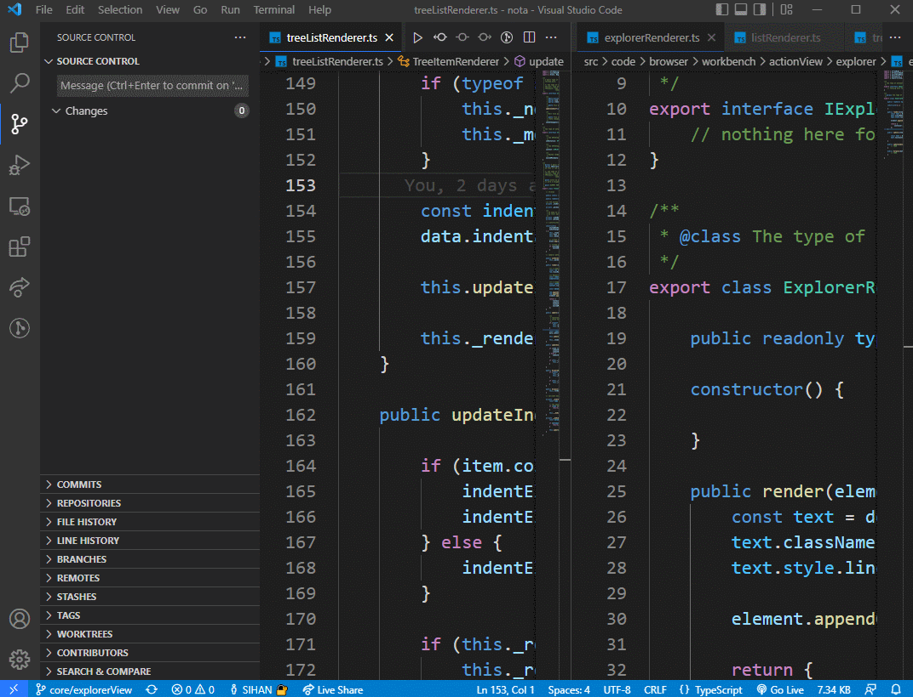

`vscode`中，它将`Version Control`这一栏嵌套在了`Side Bar`中。而它将git所支持的大部分功能以dropdown的形式存放了起来，将绝大部分的空间留给了记录文件变化本身上面：

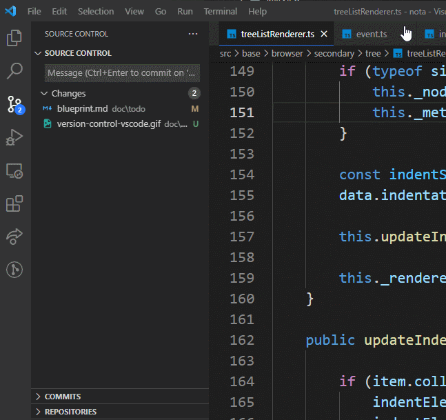

> **这一段写给Yanna的**：介于你可能不太了解Version Control这一套工具的运作逻辑🤔，所以具体的UI设计这上面可以留给我，到时候我会按照你已有的UI风格去模仿。

---

# 3️⃣工作区-Workspace

> 所谓工作区域，就是users可以修改files / pages的地方。

## 案例展示

从左往右分别是`Typora`, `vscode, `, `Obsidian`和`marktext`:

| 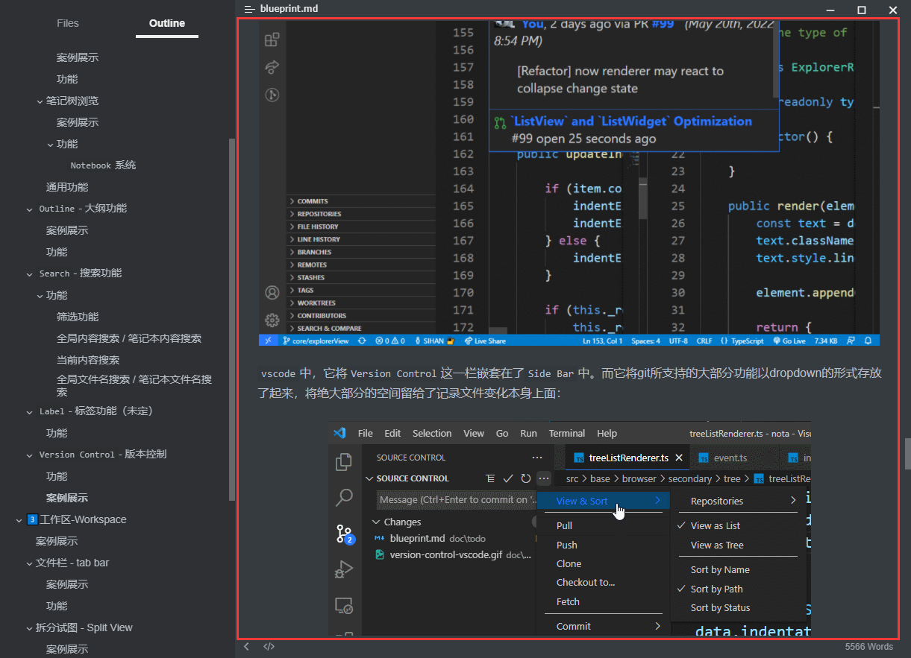   | 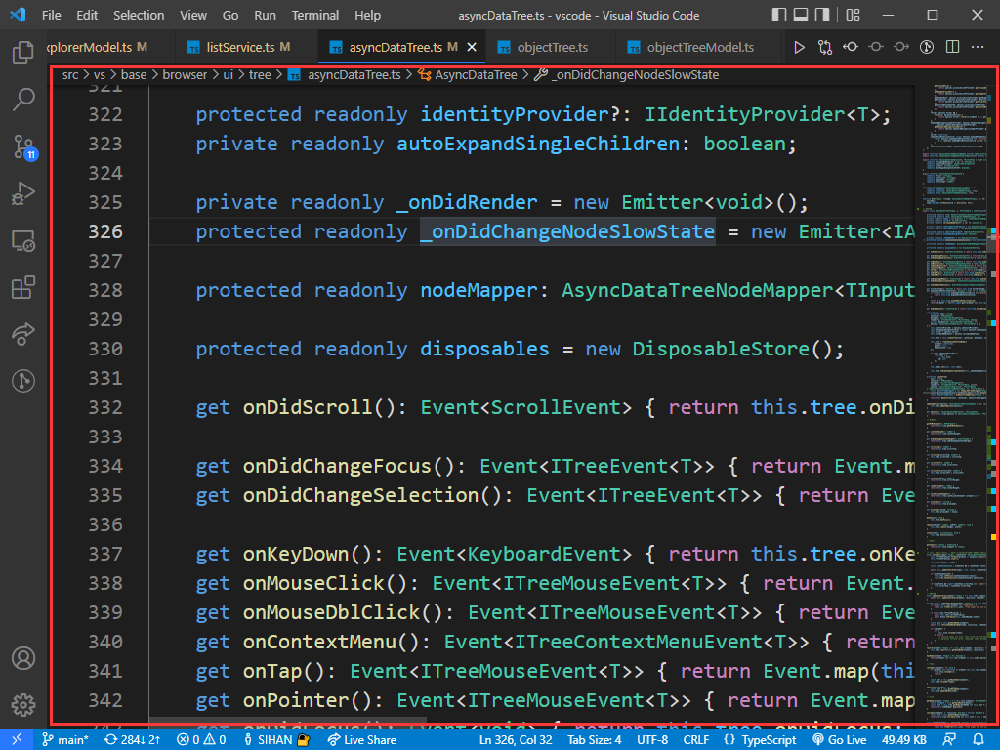   |
| --------------------------------- | --------------------------------- |
| 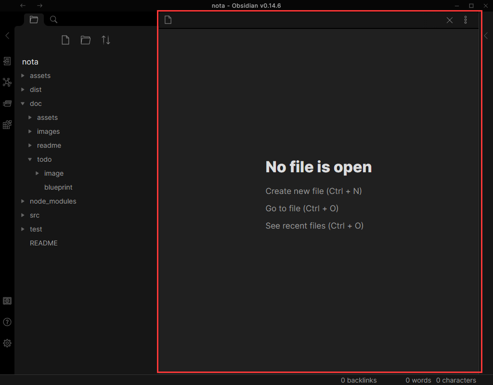 | 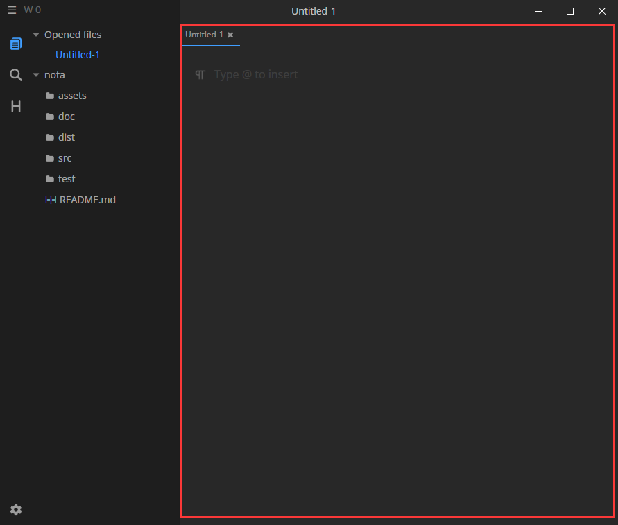 |

> ⭐需要注意的是，由于markdown文件本身和txt文件没有任何区别，都是一串纯文本而已。
>
> 而`nota`用的是一个开源的第三方markdown渲染库叫做tui.editor（很快会换成另一个叫做milkdown，主要原因是因为我觉得milkdown的UI更好看）。渲染库的功能就是将markdown里的源文本根据全世界公认的一些规则去渲染出来对应的画面，只不过不同的渲染器在一些细节上采取的样式会不同。
>
> 因此Yanna暂时可以忽略这里面的渲染细节，因为这些渲染器都已经提供了一个预设方案，不过我们也确实可以在代码层面（CSS为主）上二次更改😎。
>
> （这里是milkdown的[官方🔗](https://milkdown.dev/)）
>
> 下面是milkdown两种theme下的部分截图：
>
> | 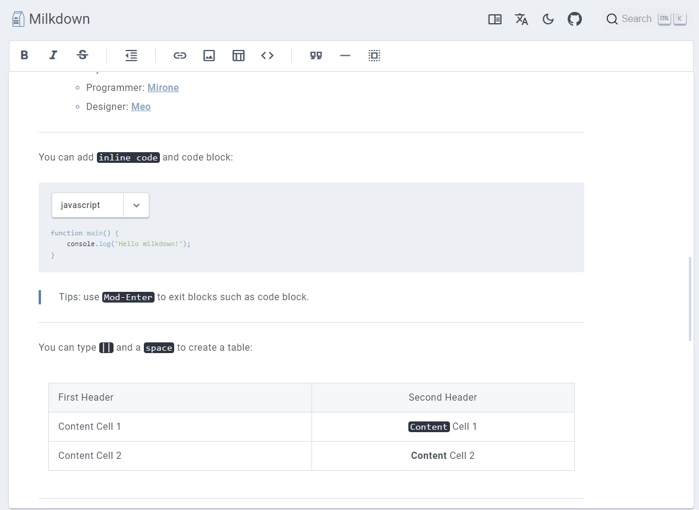 | 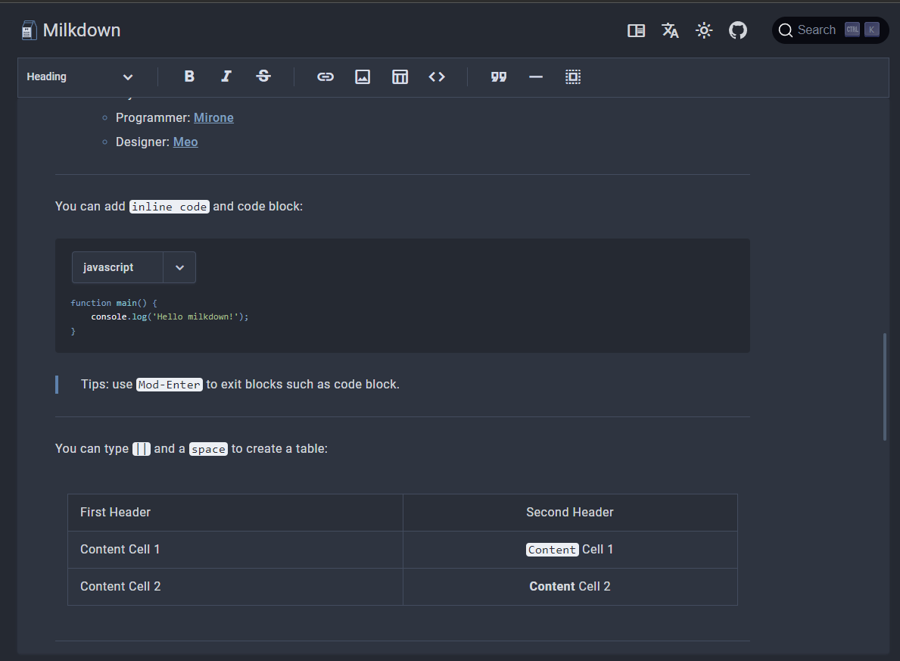 |
> | --------------------------------------- | --------------------------------- |

## 拆分试图 - Split View

### 功能

> 允许users将当前的工作区进行分半（Split），两个工作区可以同时显示不同的files。方便users同时查看多个files。
>
> 这个功能在我的视野里，所有富文本类型的笔记软件全部都没有这个功能（如果真有的话可以通知我一下👀我去用用看哈哈）。

### 案例展示

从下往上分别是`vscode`和`obsidian`的split view展示：

| 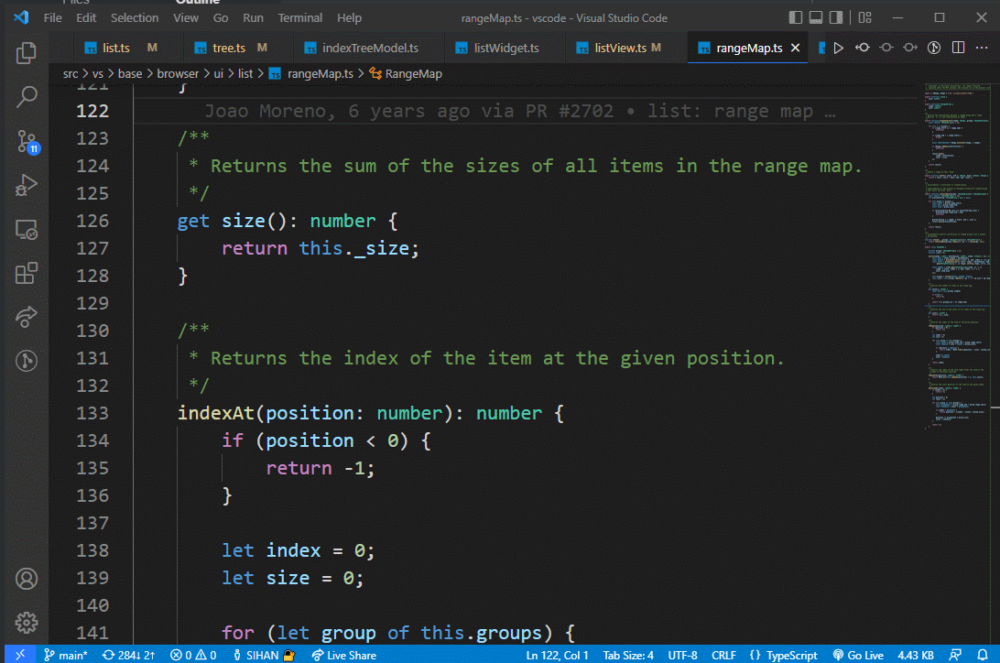   |
| ------------------------------------------- |
| 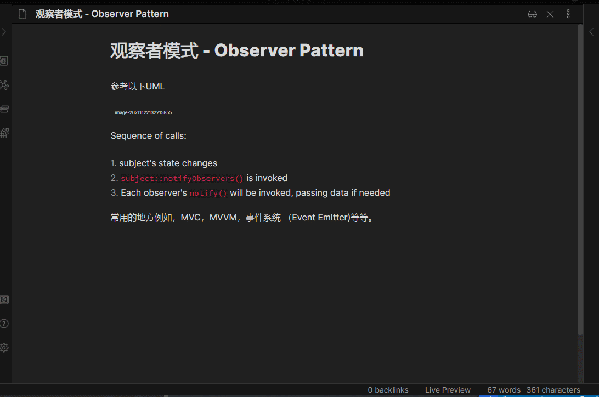 |

## 无障碍快速插入功能 - Accessible Quick Insert

### 案例展示

从左往右分别是`Notion`和`Marktext`:

| 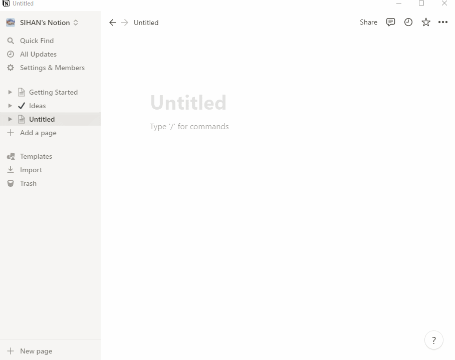 | 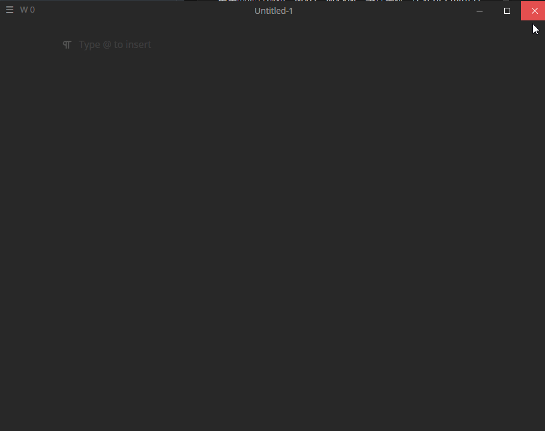 |
| ------------------------------------------- | --------------------------------------------- |

### 功能

> 这也是一个我非常喜爱的一个设计：它能很大程度上减少新用户的学习成本，同时对于不太熟悉甚至是完全不会写markdown的人，也能最大程度上减少学习成本。

在`Notion`里，输入正斜杠`/`即可调用`无障碍快速插入功能`，紧接着可以进行鼠标选择，或者打出对应功能的名字即可完成快速选择。在`Marktext`里则是要输入`@`符号，同时`Marktext`相比`Notion`在细节上更进一步，它支持了模糊搜索（Fuzzy Search），进一步地提高了users输错地容错率。

## 悬浮工具栏 - Hovering Tool Bar

### 案例展示

下面分别是`Notion`, `Marktext`和`onenote for Windows 10`:

| 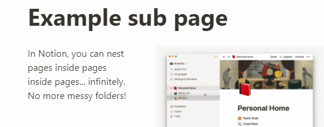    |
| ----------------------------------------------- |
| 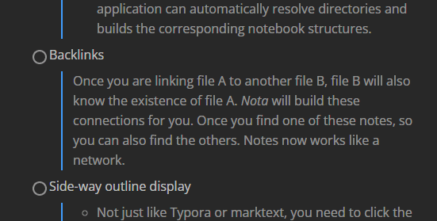  |
| 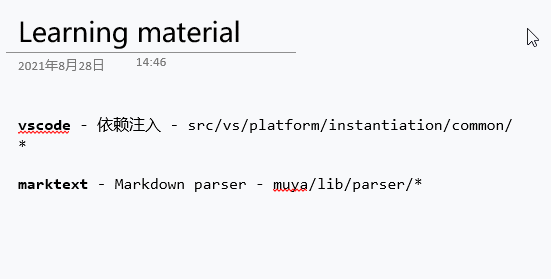 |

### 功能

> 这个功能和users去主动右键弹出来的右键菜单（Context Menu）稍微有点不一样：
>
> 1. 一旦选择了文本之后就会自动显示出来的迷你型工具栏（Toolbar）（可在设置里进行开关）。
> 2. 它只包括了常用的一些基本功能。如果有塞不下的情况，需要右键菜单来完成。

## 侧边大纲渲染 - Sideway Outline

### 功能

> 干的事情和其功能和[Outline`- 大纲功能](#Outline--大纲功能)一模一样。只不过这里会额外的渲染在工作区旁边，方便查看（可在设置里进行开关）。鼠标没有悬浮（Hover）在上面的时候显示为淡色。

### 案例展示

网络截图：

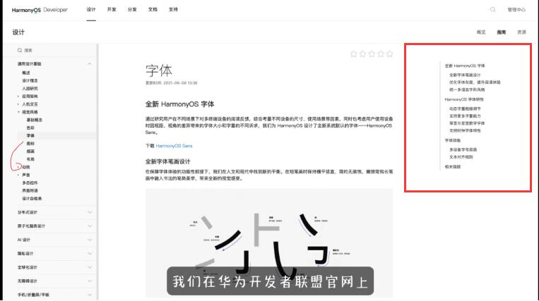

---

# 4️⃣状态栏-Status Bar

## 功能

> 用来显示一些当前软件的基础信息，当前选择文件的基础信息等等。
>
> 需要注意的是这种功能常常出现在具有编辑器性质的软件里，除了`vscode`本身就是代码编辑器之外, `Typora`, `Obsidian`都拥有status bar。`Marktext`之所以没有是因为它的设计理念是超简洁。

## 案例展示

从左往右分别是`vscode`, `Obsidian` (`Typora`的过于简单，就显示了个字数，没了，懒得截图了😣):

| 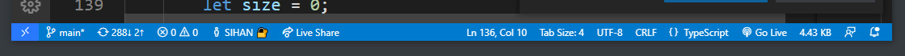   |
| --------------------------------- |
|  |

## 弹窗对话 - Dialog Box

### 案例展示

以下为`vscode`截图:

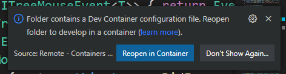

### 功能

> 当程序需要users主动进行一些操作（选择）/ 或者需要提醒users一些信息的时候，程序会在某处（比如右下角）弹出一个弹窗（Dialog Box）。

## 整体架构可自定义性

这个功能在代码实现上会比较繁琐，需要一个底层设计很好的框架才行。和Yanna应该没太大关系，Jerry的`SplitView`的robustness得写的够好才行。

下面是`vscode`的效果：

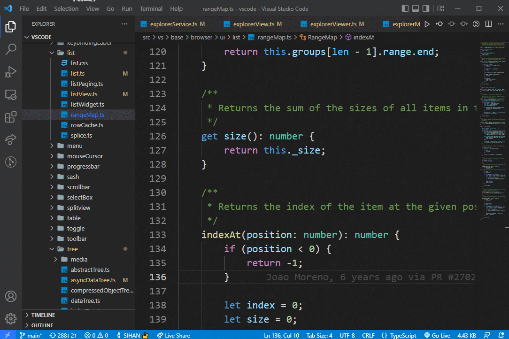

---

# 5️⃣双链系统-Backlinking(暂定)

> 这个功能是我在前几天发现了个软件叫作`Obsidian`之后才逐渐了解的一个功能。简单来说一句话概括就是：当一个file A里面有个link主动链接到了file B，那么此时此刻file B也会知道file A的存在。

## 案例展示

下面是`Obsidian`内部的展示:

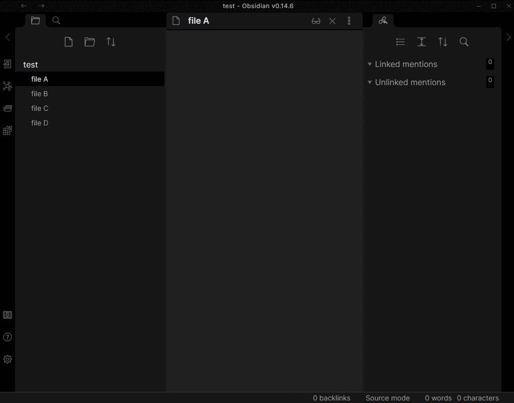

## 功能

在`Obsidian`的设计里它是把该功能单独放在了右侧，甚至为它添加了一个Collapse or Expand的按钮，有一层意思是想告诉users多用用这个功能。参考我们本身的优势[整体架构可自定义性](#整体架构可自定义性), 也可以考虑直接放在`Side Bar`里。

> 我之所以标记为这个功能为暂定，更多的主要是刚见识到这个功能没多久，或许在以后的日子慢慢了解完之后发现不适合`nota`也一定可能。因此我暂时标记为*暂定*。

---

# 6️⃣控制面板-Command Palette

## 功能

> 特点是可以通过快捷键（Shortcut）打开，常见的为Control+P或者Control+Shift+P。打开以后可以进行全局搜索软件所支持的所有**命令（Command）**。
>
> 比方说：不管是代码编辑器也好，还是笔记软件也好，最常见的功能就是字体的放大和缩小（Zoom In / Out）。对于没有控制面板（Command Palette）的软件来说，用户很可能需要去打开[7️⃣设置系统-Settings](#7️⃣设置系统-Settings)，然后在里面找到对应的设置进行修改。
>
> 如果users平时需要频繁进行某一个操作，去找对应的按钮，甚至是需要打开设置系统去寻找对应的配置也好，这样会日积月累增加很多时间成本。这个时候控制面板（Command Palette）的好处就体现了：搜索命令名字并按以下回车即可（同时要支持模糊搜索（Fuzzy Search）。上面提到的Zoom in / Out就是一种例子。

## 案例展示

下面是`vscode`和`obsidian`的效果展示：

| 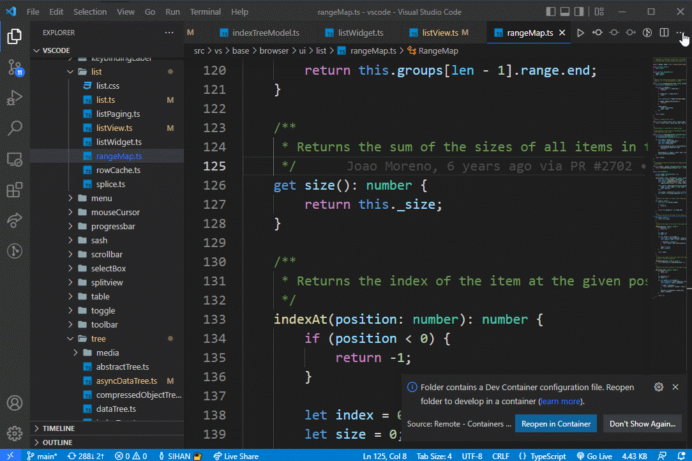 | 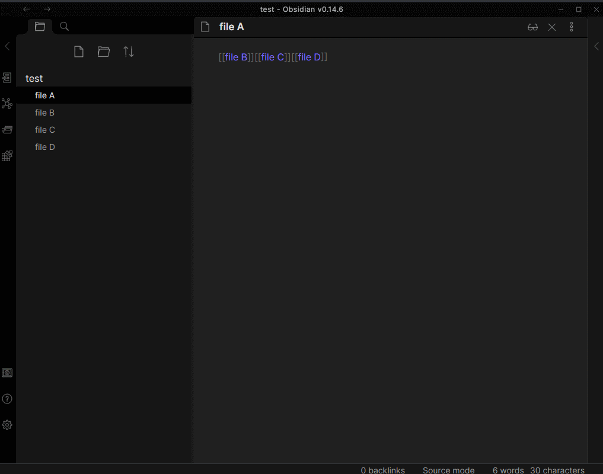 |
| ----------------------------- | ------------------------------- |

# 7️⃣设置系统-Settings

## 功能

> 就是每个软件都会有的一个设置页面。这个页面主要功能就是用来修改设置，调试插件，更改软件的theme等等。
>
> 这里可以提一下我见到过的，设置系统设计方案常见的一些选择：
>
> 1. 第一种就是除了软件本身，还会打开一个额外的窗口（可拖拽的那种，有的是在软件本身内模拟一个窗口，有的是真的打开了一个额外窗口），这个窗口就是设置系统自身。
> 2. 第二种就是将设置页面直接融入到软件内，比如会霸占整个[3️⃣工作区-Workspace](#3️⃣工作区-Workspace)，然后将设置系统当作一个file一样内嵌进去，然后提供一些特殊的UI进行修改。

## 案例展示

我随便挑几个展示吧，我相信是个正常人用过几个软件都能想象得出来长啥样（其实是真写不动了要累趴了😓呜呜呜）。

从左往右`vscode`和`marktex`:

| 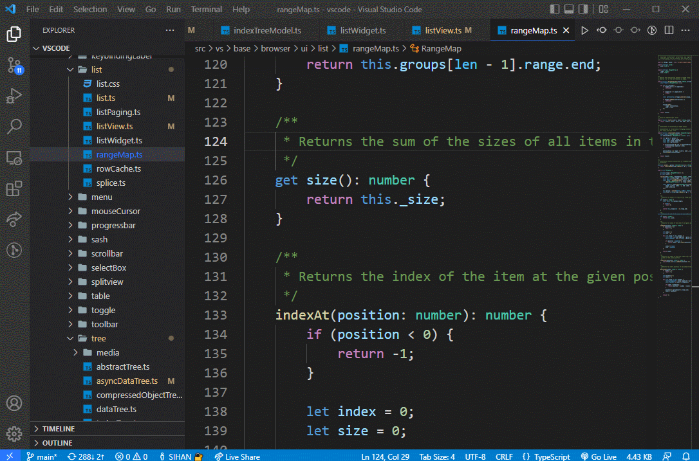 |  |
| ------------------------------ | -------------------------------- |

# 8️⃣帮助界面-Help

## 功能

直接看展示！

## 案例展示

从左往右 `vscode`, `obsidian`:

| 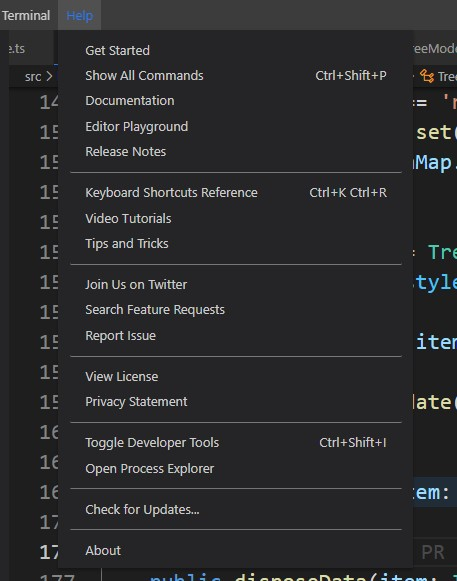 | 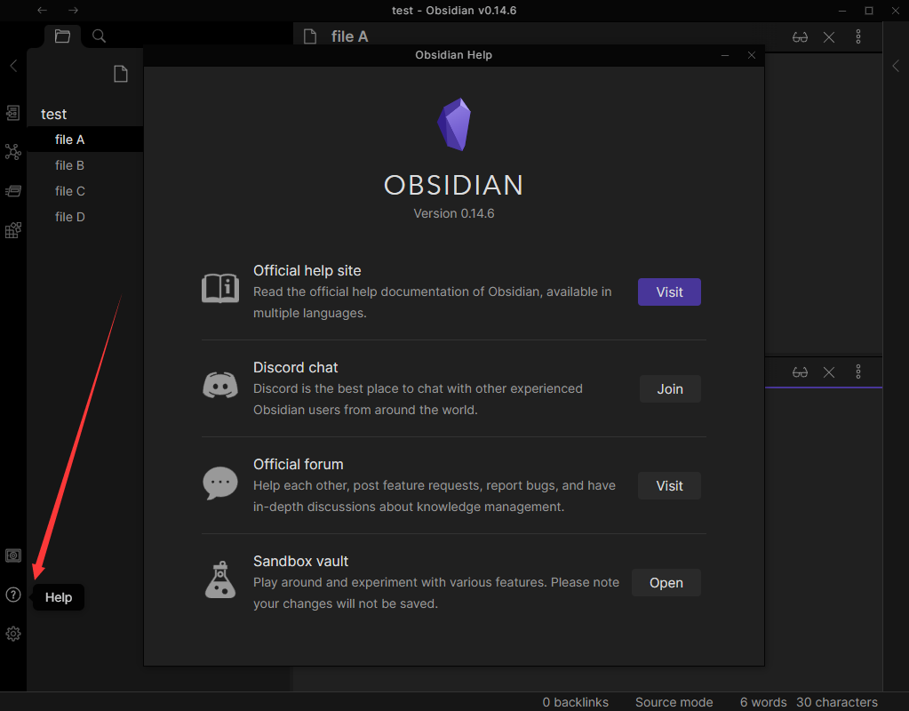 |
| -------------------------- | ---------------------------- |

