# 0️⃣nota设计蓝图

1. [1️⃣功能栏 - Action Bar](#1️⃣功能栏-Action-Bar)
1. [2️⃣侧边栏-Side Bar](#2️⃣侧边栏-Side-Bar)
1. [3️⃣工作区-Workspace](#3️⃣工作区-Workspace)
1. [4️⃣状态栏-Status Bar](#4️⃣状态栏-Status-Bar)

---

# 1️⃣功能栏-Action Bar

> 功能栏目前主要有这些按钮: `Explorer`, `Outline`, `Search`, `Version Control`，`Help`和`Settings`. 除了`Help`，`Setting`，其他的按钮主要功能是切换[2️⃣侧边栏-Side Bar](#2️⃣侧边栏-Side-Bar)所展示的区域。

## 案例展示

从左往右分别是`Visual Studio Code（之后缩写为vscode）`，`marktext`，`onenote for Windows 10`，`Obsidian`。前三个软件的`Action Bar`全部放在软件的最左侧，并且每个按钮会控制着紧贴着的侧边栏所展示的内容。需要注意的是，`Obsidian`的`Action Bar`比较特别，左侧的四个按钮和`Side Bar`是解绑的。只有靠上面的两个按钮绑定着`Side Bar`的显示内容。

| 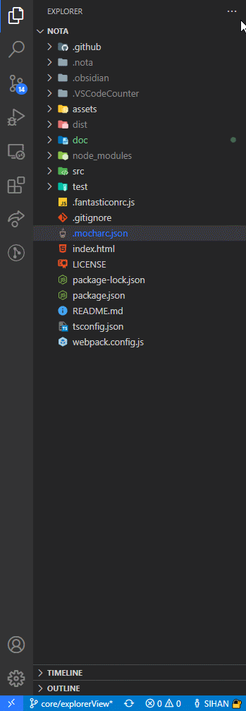 | 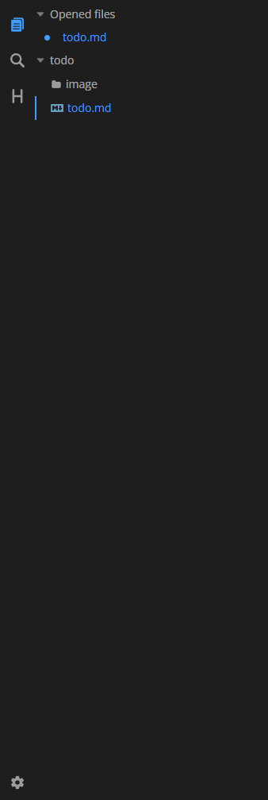 | 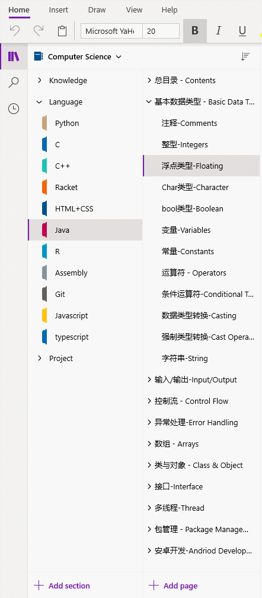 | 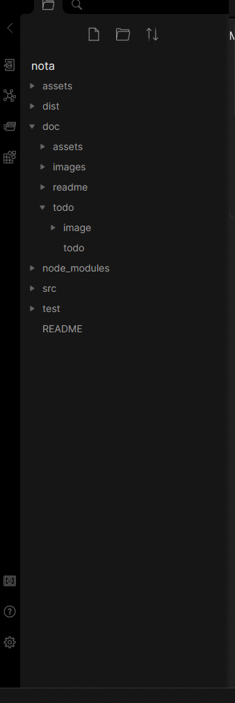 |
| ---------------------------------- | ------------------------------------ | ------------------------------------- | ------------------------------------ |

## 功能

1. 除了支持上面常见的'切换'功能，还有一个功能点在前三个软件里都有实现（截gif的时候忘记测试了），就是当你再一次点击已经选择的Action Button的时候，会把`Side Bar`进行收缩，如下：

    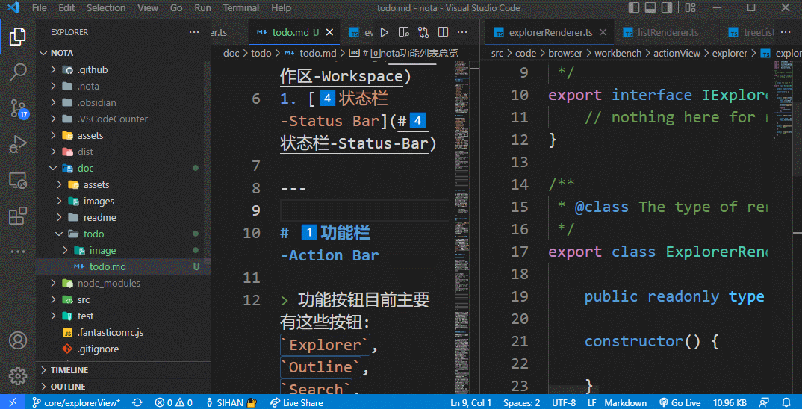

---

# 2️⃣侧边栏-Side Bar

> 侧边栏是和[1️⃣功能栏-Action Bar](#1️⃣功能栏-Action-Bar)所一一对应的显示区域，每一个功能按钮可以切换至不同的侧边栏显示内容。

## `Explorer`- 文件树 / 笔记树

> 在这个区域中，会出现两种渲染模式，举个例子比如通过一个按钮来切换模式。第一种是经典的[文件树浏览](#文件树浏览)，第二种是[笔记树浏览](笔记树浏览)。

### 文件树浏览

#### 案例展示

最常见的编辑器（Editor）中所会出现的一种模式，从左往右分别是`vscode`, `Typora`，`Obsidian`, `Marktext`四款软件的文件树浏览操作展示：

| 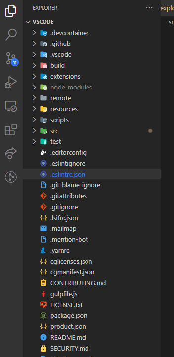 | 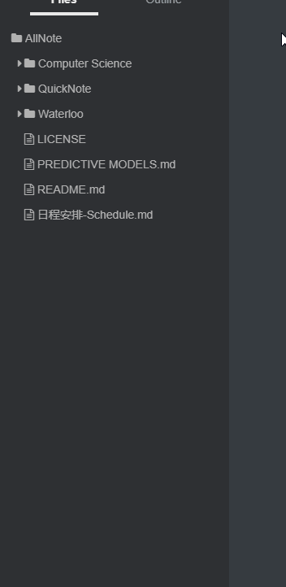 |  | 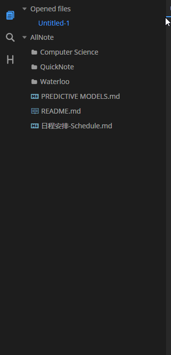 |
| ------------------------------------ | ------------------------------------ | -------------------------------------- | -------------------------------------- |

除了`vscode`是一款代码编辑器，剩下的三款软件的产品定位都是Markdown编辑器（不过`obsidian`更复杂一点，它的定位和`nota`一样，都是基于markdown的笔记软件而非编辑器。它支持笔记双链（`backlinking`），知识图库分析等等）。

#### 功能

这种文件树浏览最大的特点是：

1. 在同路径（Path）下，文件夹（directory）显示顺序永远比文件（file）更靠上面。
2. 排序上，只会有常见得按Alphabet排序，创建时间排序，修改时间排序。Users不能进行自定义（custom）排序。在Drag and Drop（dnd）支持上，users进行拖拽（drag）文件时，只允许进行摆放（drops）到不同的directory下面。如果试图摆放在同目录下不同的位置上（试图进行自定义排序），并不会发生任何变化。
3. 想要实现嵌套关系（nesting），只能通过创建directory来实现。但是限于第一条，强行做嵌套关系会显得格外的蠢🥱。
4. 因为数据是用户自己的，文件树所展示的样子，就是当前电脑上操作系统（Operating System，之后简称OS）（常见的MacOS，Windows，Linux）里真正的文件树的样子，没有丝毫分差。

在`nota`的文件树浏览模式下，所呈现的效果和主要功能就如上面gif和列出来的四点一样。

### 笔记树浏览

#### 案例展示

目前市场里，我只在富文本类型的笔记软件下能见到这种文件树浏览，同时也是每一个富文本类型笔记软件的标配。从左往右分别是`notion`，`onenote 2016`, `onenote Windows 10`：

> （因为是富文本的原因，所以市场上各种软件的渲染方式、操作方式属于是百花齐放了，主要我也懒没下其他软件（逃（不过这三款应该已经足够去展示其主要特点了🙂）。

| 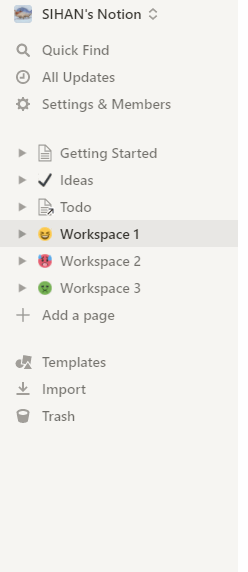 | 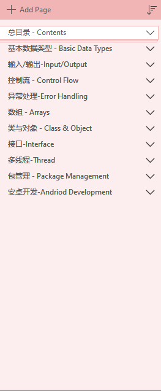 | 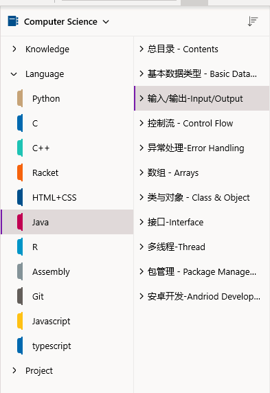 |
| ----------------------------------- | ---------------------------------------- | -------------------------------------- |

#### 功能

笔记树浏览和经典文件树浏览最大的区别如下：

1. 没有文件（File）和文件夹（Directory）的概念，只有类似于笔记页（Page）的概念，因此笔记页可以进行互相的嵌套（Nesting）也是理所当然的事情。
2. 通过丰富得Drag and Drop（dnd）功能，users可以通过拖拽，能够进行简单易用的排序，嵌套等操作。
3. 笔记树浏览常见于富文本型笔记软件，由于用户的数据本身是和软件自身绑定的，是用户自己看不见摸不着的。因此笔记树所展示的效果跟当前OS里的真实数据没有任何关系，缺少了一种直观性。

可能会出现的按钮：

> 这里按钮的存在属于根据风格来调整，可以添加一些常用的按钮安放在`Explorer区域`的某处，比如：
>
> 1. 比如`收缩所有-Collapse All-收缩所有的展开的文件夹`，
>
> 2. `创建/删除 File/Directory/Page（我这里叫做Page是想特指在第二种渲染模式下只有一种概念叫做Page）`。
>
> 3. `按照XXX排序`。P.S. 在onenote中有会提供一个下拉按钮，有四种选项，分别是`None`, `Alphabetical`, `Date Created`和`Date Modified`。`None`指的就是采用用户自己customized排序。
>
> 为了简洁的风格，这些按钮完全可以交给右键菜单（Context Menu）去完成。

>  P.S. 应该对于绝大部分的功能来说，所有经典文件树浏览所支持的功能，在笔记树浏览下也能支持。但是在第二种笔记树浏览下，它的右键菜单（Context Menu）的功能会出现个别只有在这个模式下才会用的功能。

`nota`想要干的事情就是将这两种渲染方式的优点结合在一起。目前我能找到的所有使用markdown为数据储存的软件，不管定位是编辑器还是笔记软件，都采用的是文件树浏览。

> **下面是相关技术细节，可以略过**
>
> 这里插一句题外话，就是关于`nota`在第二种渲染模式下，要如何既能展示user的数据在操作系统下真实结构的同时，也能实现富文本笔记软件标配的丰富的Drag and Drop Support。
>
> * 如何实现排序：对于在OS里的同directory下的files，如果users在软件里面进行了custom排序，在OS里面不会进行任何操作，`nota`只会在软件层记录排序并渲染给users看，让users以为进行了排序。之后`nota`在关闭软件之后只会将这种顺序关系储存在硬盘里，下次打开同目录的时候再次读取该类信息重新渲染出来排序过后的样子即可。
>
> * 如何实现嵌套：我个人的认知中，这个业务需求的本质，是怎么将OS里的两种概念文件（File）和文件夹（Directory）巧妙地结合在一起。我的逻辑可以分成两步骤：
>
>     1. 在扫描完OS中当前目录（path）下的所有files和directory后，但在渲染画面前，通过一个customizable的`匹配规则（见后面解释）`将同path下的file和directory在软件层面里匹配在一起。
>
>     1. 渲染画面时，只会渲染files。如果当前files有互相匹配的directory，并不会渲染directory本身，只会将directory下面的所有内容渲染成嵌套在自己所匹配的file下。之后以此类推，按理即可完成OS下也能渲染出笔记树的效果。
>
>     `匹配规则`：默认的规则非常简单，只要将同名的file和directory进行匹配即可。之所以将这里设计成customizable，因为有些users已经有了自己的一套命名系统，比如有的人file名字叫做work.md，它所对应的文件夹叫做directory-work.md。那么users只要将所有名为directory-xxx的directory和名为xxx的file匹配即可。

##### `Notebook`系统

在`笔记树浏览`下，`nota`除了将来会支持复杂的dnd支持，除此之外还借鉴了`onenote`里面的笔记本系统，下面从左往右分别是`onenote for Windows 10`和`onenote 2016`中的笔记本系统的演示：

| 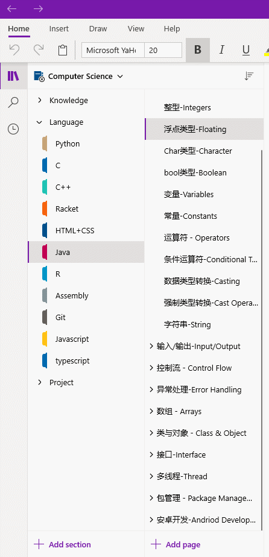 | 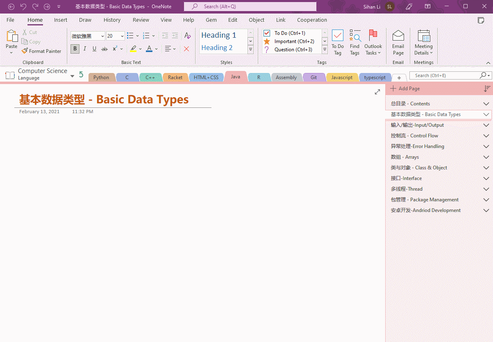 |
| ------------------------------------------ | -------------------------------------------- |

我个人比较喜欢这种设计：主要原因是因为既然`nota`的产品定位是个笔记软件，每个user会尝试搭建自己的笔记体系，而笔记形状可以用树形结构（Tree）来表达。现实中，user在长时间内往往只会频繁地访问树中得一个大分支内的笔记，如果将整棵树全部渲染在`Explorer`内的话，将会浪费大量的空间，会很大程度地浪费各种资源，包括但不限于增加了user自己查询笔记速度，user视觉里需要负担更多信息处理等等。

但如果我们利用一个下拉按钮（Dropdown Button），将整个笔记系统分成不同的`notebooks`，那么`Explorer`只需要渲染当前的`Notebook`下的所有笔记即可。

> **下面是相关技术细节，可以略过**
>
> 关于如何将OS下的文件树去渲染成不同的`notebook`s，目前的方案是，当user第一次打开一个笔记的根目录（Root）时，假设root为`chris/data/waterloo`，那么`nota`会去读取该路径下的所有文件夹，将每个文件夹当作一个`notebook`。假设root下有三个文件夹分别叫做`CS135, CS136, CS245`，那么我们的下拉按钮那里就会出现三个按钮选项分别名为这三个文件夹。
>
> 关于如果root下有一些文件的话，一种选项是直接忽略它们。我还能想到一种是自动创建一个`notebook`叫做`Quick Notebook`之类的，然后把这些文件当作笔记（Pages）放进去。
>
> 至于users在配置或者设置上能不能更改上面的则我暂时还没想好，有想法欢迎进一步讨论。

### 通用功能

1. 鼠标悬浮（Hover）在文件（File）、文件夹（Directory）或者笔记页（Page）的时候，会有相关信息展示，这些软件大部分除了展示信息，还有`obsidian`特地做了动画（Animation），所以拿做一个案例：

    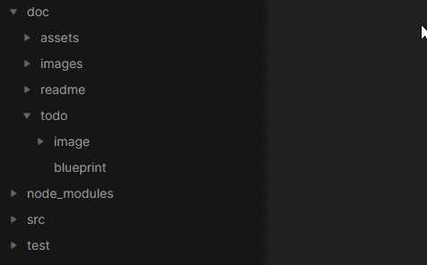

2. 右键菜单（Context Menu）。file，directory和pages的右键菜单除了一些通用的，也会有一些细微的区别，取决于它是哪种类型。
3. 收缩图标。软件为了表示collapse和expand两种不同状态，常见的选择是要么一个三角形，要么选择一个文件夹的icon并具有打开与非打开的状态。也有笔记软件选择不用任何图标，只用缩进（indentation）来完成嵌套的表示（比如onenote就这么干，主要原因是它的pages嵌套关系只允许最高3层，所以用不到图标，图标反而加重了视觉观感）。

## `Outline`- 大纲功能

需要知道的一个前提是，在markdown文件中，提供了一共六种不同的**标题（heading）**大小：

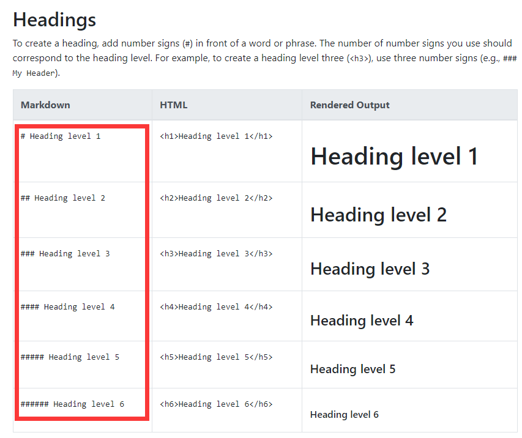

而`Outline`区域干的事情，**就是将当前[3️⃣工作区-Workspace](#3️⃣工作区-Workspace)所选择（Focused）的file里的所有标题（Heading）进行单独拎出并以树（Tree）的形式进行渲染**。

### 案例展示

从左往右分别是`Typora`和`Marktext`两款markdown编辑器所支持的outline渲染案例（比较惊讶于`Obsidian`竟然没有这功能）：

| 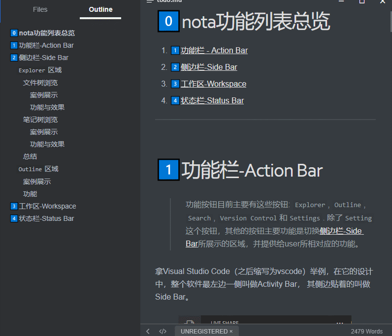 | 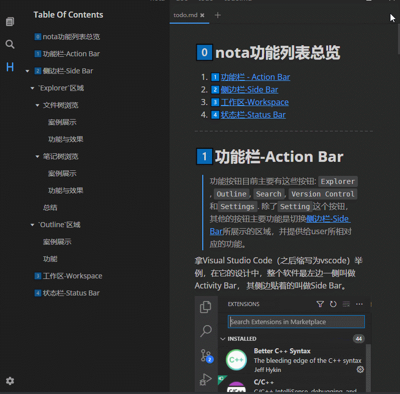 |
| ----------------------------- | ------------------------------- |

### 功能

这里的功能会很简单，目前我能想到的有以下：

1. 渲染方式：以树形结构（具有嵌套关系）的渲染方式渲染headings。
2. 跳转：点击渲染出来的heading，会跳转到当前打开文件下所对应的heading。
3. 收缩：像`marktext`一样（`Typora`是可选项），对于有嵌套关系的headings可以进行Expand and Collapse。

## `Search`- 搜索功能

### 功能

在整个软件中，应该总共会支持三种主要的搜索范围：分别是`全局内容搜索 / 笔记本内容搜索`, `当前内容搜索`和`全局文件名搜索 / 笔记本文件名搜索`。目前方案的排版时：对于`全局内容搜索 / 笔记本内容搜索`来说，搜索功能做在`Action Bar`和`Side Bar`里面。`当前内容搜索`肯定是通过control+F以快捷键的方式直接做在[3️⃣工作区-Workspace](#3️⃣工作区-Workspace)里面（后面细讲）。`全局文件名搜索 / 笔记本文件名搜索`暂定是做在[6️⃣控制面板-Command Palette](#6️⃣控制面板-Command Palette)（后面细讲）。

#### 筛选功能

所有搜索种类，都可以进行一系列预设（Preset）的筛选，最常见的：

1. Match Cases （匹配大小写），
2. Match Whole Word（匹配整个文字段）。

在此基础上，`vscode`提供了按照`Regular Expression`功能搜索（`nota`也会）。同时还支持了全局替换（下面gif会演示）（这个功能先不考虑进去，我不太确定笔记软件到底需不需要这种功能🤔）。

除此之外，`onenote for Windows 10`和`obsidian`支持按照`标签（tag）`进行搜索（下面gif会演示）（因为它们的产品定位是笔记软件，因此多一个标签系统）。关于标签功能`nota`也会有，后面很快会提到，这里先不涉及标签搜索。

`vscode`和`obsidian`还支持了收缩（Collapse All）所有的搜索结果（`nota`也会，这个功能又简单又好用`T-T`）。

#### 全局内容搜索 / 笔记本内容搜索

当打开了一个根目录时（Root），这个root下的所有文件我们称它为全局。全局内容搜索，就是提供一段文字内容，软件会列出该root下所有相关的搜索结果。以下从左往右分别是`vscode`，`onenote for Windows 10`，`Typora`和`Obsidian`的搜索功能演示：

| 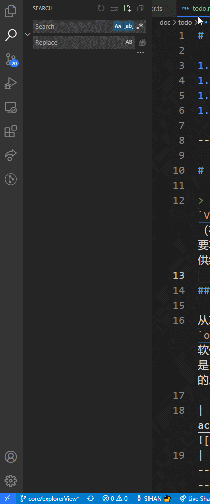 | 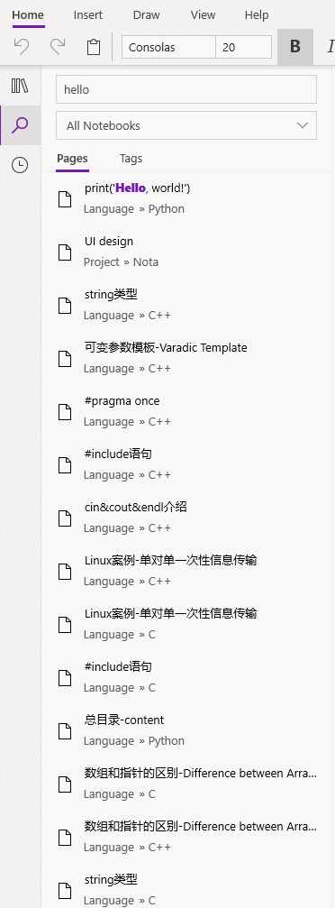 | 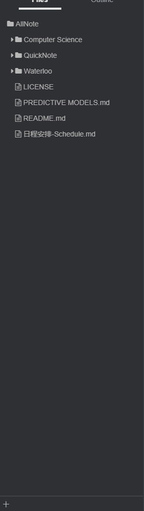 | 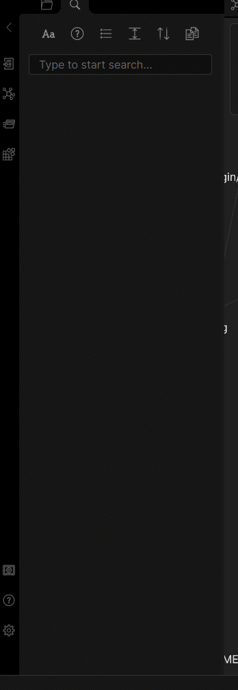 |
| ------------------------------------------- | ---------------------------------------------- | ------------------------------------------- | --------------------------------------------- |

> 插一句题外话，以上四个产品的选择方案是将`全局内容搜索`的功能放在了`Side bar`里面。除此之外，比如`Notion`是将全局搜索功能单独开辟了一个窗口放在了软件中间可以搜索。`Notion`采用这种方式其中一个原因是它是两栏式排版，没有`Action Bar`。介于因为排版本身的差异，因此并没有在上面列出来作为参考。

#### 当前内容搜索

> 只对当前打开的文件内进行搜索内容。常见的是按下快捷键Control + F即可。

以下是最常见的类型，从左往右分别是`marktext`, `vsocode`，第二行从左往右是`Typora`，`Notion`:

| 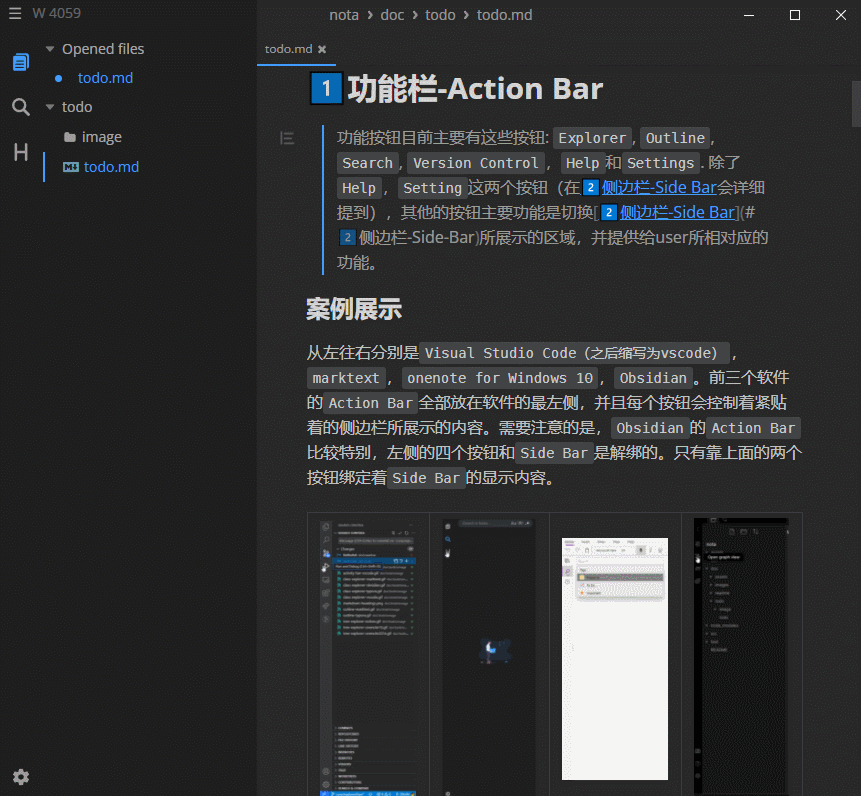 | 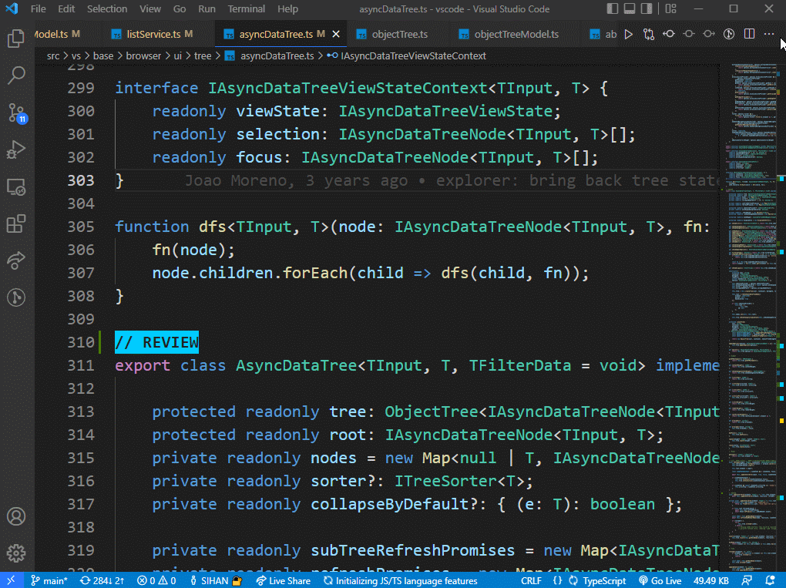 |
| ---------------------------------------------- | -------------------------------------------- |

| 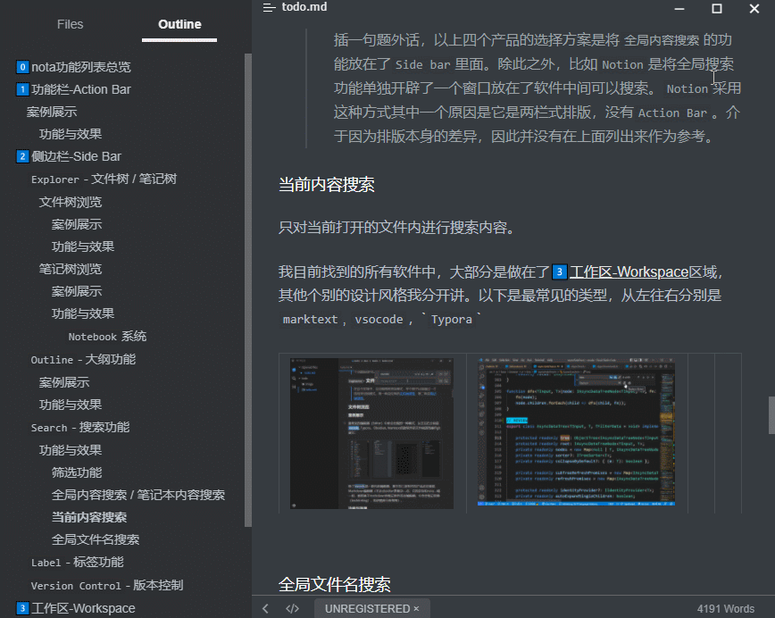 | 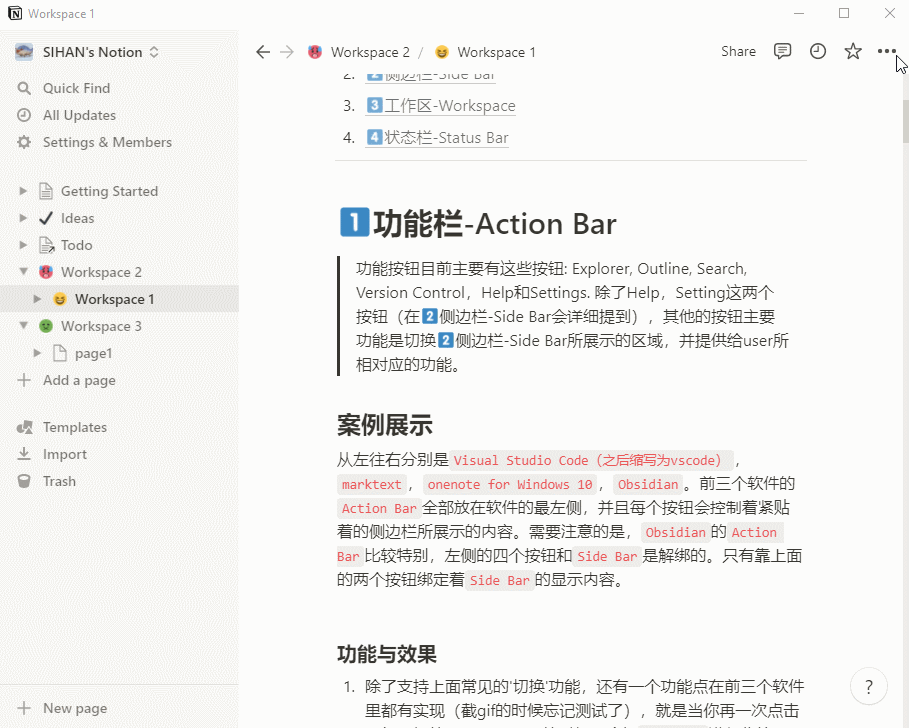 |
| -------------------------------------------- | -------------------------------------------- |

上述四款软件是单独做了UI，做在了[3️⃣工作区-Workspace](#3️⃣工作区-Workspace)区域。同时会高亮所选内容，并且可进行上下跳转。

还有一种设计方案是将该功能与`Side Bar`结合在一起，两款`onenote`都是这么做的，下面拿`onenote for Windows 10`举例:

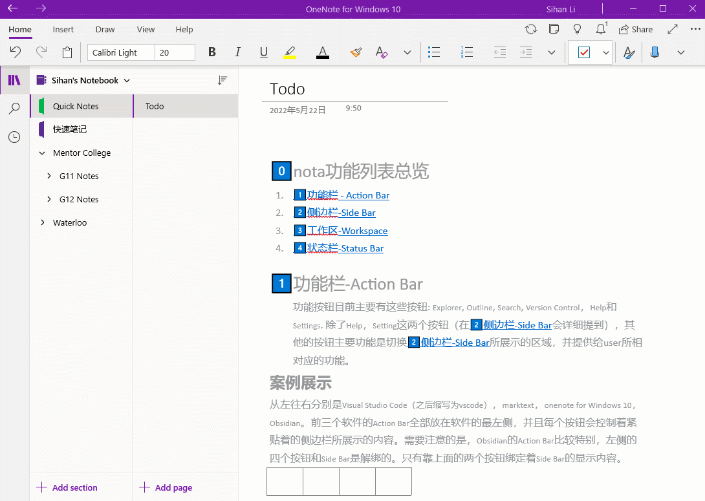

#### 全局文件名搜索 / 笔记本文件名搜索

> 如其名，这里只对文件名进行筛选，作用范围分成全局和笔记本。

这里列出来两种不同的设计方案，分别是`vscode`和`obsidian`:

| 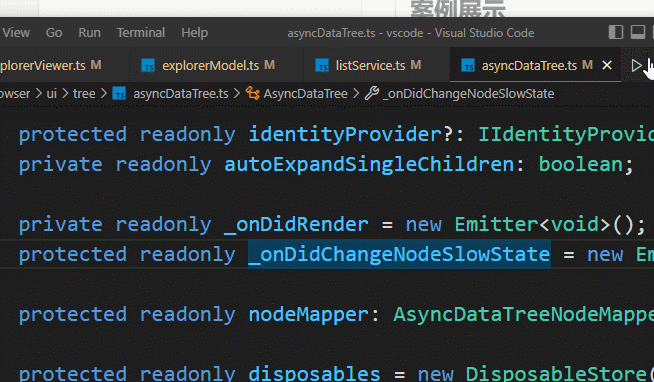 | 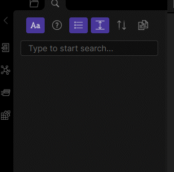 |
| -------------------------------------------- | ---------------------------------------------- |

`vscode`的选择是单独在软件画面中上部创建了一个[6️⃣控制面板-Command Palette](#6️⃣控制面板-Command-Palette), 通过快捷键Control + P打开。

`obsidian`则是将功能结合在了`Side Bar`，通过下拉窗口进行选择。

## `Label`- 标签功能（未定）

### 功能

> Users允许给每个文件（File）进行贴标签（Label）分类。之后users可以按照已有的labels进行查找对应的files或者pages。

插一嘴：这个功能现在确实写在了blueprint里面，但是临时添加的。我并没有停止思考这个功能的有效性和和必要性：

1. 在已经有了`notebook`系统和文件树这种结构天然带有分类效果的情况下，是否还需要一套标签系统？标签系统的存在代表着一套别于`notebook`的系统，它可以将来自不同的`notebook`的pages/files进行连接并统一（和[5️⃣双链系统-Backlinking](#5️⃣双链系统-Backlinking)有点类似，都能进行跨`notebook`连接）。
2. 我能想象到的应用场景：譬如users会经常出现在多个不同的地方存在未完善（unfinished）的pages，ta可以将所有unfinished的pages进行label一个比如叫做`⛔未完成`的label里。这样用户下一次回来，也不必担心分不清或者忘记哪些是unfinished的pages。
3. 标签（Tag）是以什么形式表现的呢？除了短小的纯文本，也有想过用emoji来代替（或者都支持）。
4. 在整个软件中哪里可以进行label呢?
5. label完后`Explorer`区域会显示出来吗？（譬如在鼠标hover在file/directory/page上面的时候，显示出来该物品（item）的labels）

## `Version Control`- 版本控制

### 功能

> 摘抄于网络：Version control, also known as source control, is **the practice of tracking and managing changes to software code**. Version control systems are software tools that help software teams manage changes to source code over time.

对于不了记得人上述估计会很模糊，简单易懂地去描述的话：在软件层面中，就是软件较与上个以保存的版本，回去追踪（Track）哪些文件被修改了，哪些文件是全新的，哪些文件被删除了。而这些变化在软件里会显性地帮你渲染出来，最常见的Version Control的工具就是`git`了。我们拿`vscode`的效果简单地举个例子：

---

# 3️⃣工作区-Workspace

---

# 4️⃣状态栏-Status Bar

---

# 5️⃣双链系统-Backlinking

---

# 6️⃣控制面板-Command Palette

# 7️⃣设置系统-Settings

# 8️⃣帮助界面-Help

9️⃣🔟

* 文件树浏览区域 - File Explorer View
	* 经典文件树模式
		* 功能
			* ...
		* 显示
			* 
	* 富文本文件树模式
		* 

* 文件树浏览
  * 基础功能：
    * 可以切换两种浏览模式
    * collapse all功能
    * expand all功能
    * refresh功能
    * 打字高亮搜索同名文件
  * 普通文件树浏览
    * 按编辑顺序排序、按文件创建顺序排序，按字母排序，
  * 各种基础的文件操作（包括右键菜单之类的）
  * 富文本高级文件树浏览
    * drop-down去选择不同的notebook
* 搜索栏
  * 全局笔记内容搜索
	  * 搜索框
	  * 搜索框可选选项
		  * Match Case
		  * Match Whole Word
		  * Use Regular Expression
* outline页面
  * side-way outline渲染
  * 可以进行expand和collapse
  * 点击outline的title会在编辑区域跳转到对应的title
* 设置页面
  * ...
* 工作区域（写作区域）
  * 区块：
    * 文件栏 - tab bar
      * 显示当前文件名，旁边有个×可以关闭。
    * 拆分视图 - split view
      * 可以对当前视图进行vertical、horizontal拆分。
  * 功能：
    * 当前文件replace
    * 当前文件search
  * 笔记区域：
    * 支持Tex基本渲染
    * [@] / [/] 可以弹出markdown快捷插入
    * 选中文件区域会自动弹出一个toolbar
  * 信息展示：
    * 当前文件大小、文件行数、文件字数、当前文件目录及文件名
* 全局控制面板 - command palette
  * 命令列表：
    * 全局笔记文件名搜索
    * 切换渲染模式：WYSIWYG, 源文本模式， 只读模式
    * 打字机模式、专注模式
    * 一系列跟git的命令
    * 开/关: 自动保存
    * 切换theme？
    * alt+←/→可以跳转到上一个、下一个超链接跳转。比如你从outline点击跳转到了对应的heading，可以按下alt+←再一次跳回去。
* 标签系统
  * 可以给不同的文件进行‘标签’，然后可以通过标签去进行检索对应文件。
* 双联系统
  * 显示区域：
    * 列出来当前有多少个文件与自己互相连接（以树的形式展示）
* 插件系统
  * ...
* Version Contro系统
  * git support
  * onedrive?